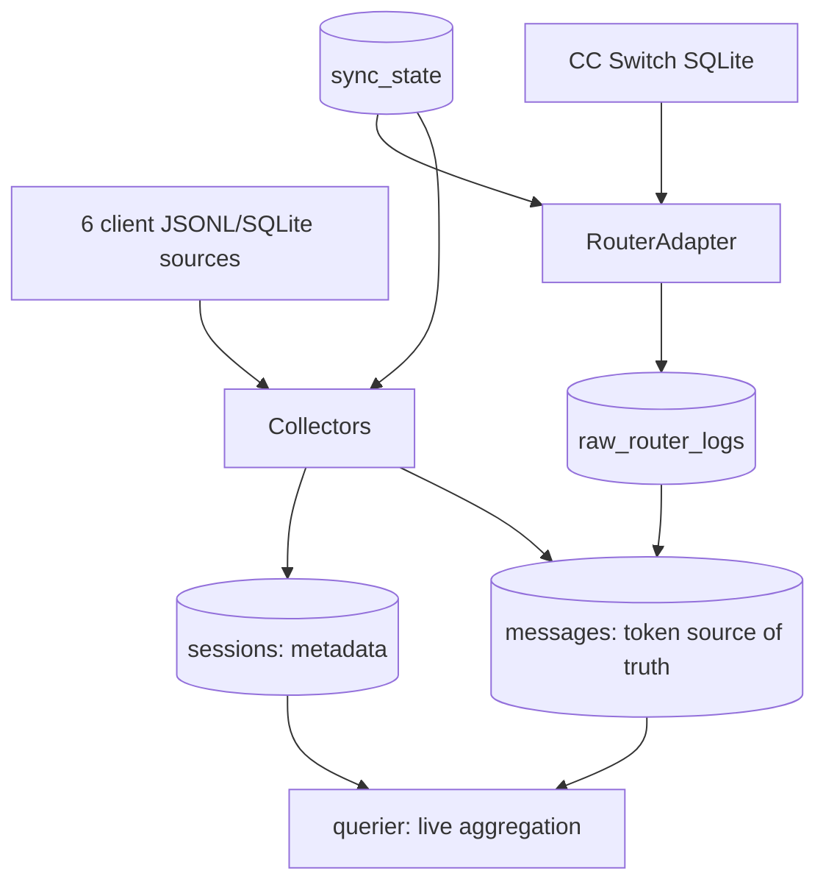

# Architecture

> [简体中文](architecture.zh-CN.md) | English

## Overview

**Purpose**: a local LLM usage analytics tool that collects, analyzes, and queries token usage across AI clients. It is distributed as a single binary and supports macOS and Windows.

**Technology stack**:

| Layer | Component |
|----|------|
| Language | Go |
| CLI | `spf13/cobra` |
| Configuration | `spf13/viper` + `pelletier/go-toml/v2` (reads TOML comments; `config set` and TUI saves fully rewrite configuration and do not preserve comments) |
| Database | `modernc.org/sqlite` (pure-Go SQLite; no CGO) |
| File monitoring | `fsnotify/fsnotify` |
| File locking | `gofrs/flock` |
| TUI | `charmbracelet/bubbletea` + `bubbles` + `lipgloss` |

**Collection granularity**: message/API-request level. Every actual model invocation is stored as an independent `messages` row instead of aggregating tokens by session.

**Core modules**:

| Directory | Responsibility |
|------|------|
| `cmd/token-usage/` | Program entry point (`main.go` only assembles the root command and calls `Execute`; an error maps to exit code 1). |
| `internal/buildinfo/` | Normalizes version and build metadata (`Current()`/`Info.Short()`/`Info.Detail()`); the `version` command and `--version` flag share the same snapshot. |
| `internal/cli/` | Cobra command assembly (config/collect/query/errors/start/status/stop/restart/version, built-in completion, and hidden `_run`). |
| `internal/configapp/` | Configuration application layer: `ApplyConfig` atomically orchestrates revision protection, writing, autostart synchronization, and action suggestions under the control lock; `AnalyzeConfigEffects` is the impact matrix. |
| `internal/runtimecfg/` | Configuration parsing boundary: `LoadEffectiveConfig` expands `~`, fills defaults and registry paths; also provides `ValidateUserConfig` and user-layer snapshots. |
| `internal/config/` | User-configuration read/write, dotted-key get/set, and the default template. Keeps the raw `[query]` section as an opaque carrier (`RawQuery` plus mutually exclusive `RawQueryTopLevelIssues`) so query semantics are never validated on the global load path. |
| `internal/querydef/` | Pure-function parser that turns the raw query state into validated, read-only definitions (built-in dimensions, subqueries, groups, default); no file or DB access, and `internal/config` does not depend on it. |
| `internal/control/` | Process-control layer: control lock, `Manager` Start/Stop/Restart/Inspect, and parent-child control leases. |
| `internal/daemon/` | Daemon core: daemon lock, PID, detached spawn, and `startupCoordinator` (monitor ready → catch-up). |
| `internal/runmeta/` | Daemon two-file metadata protocol: PID file plus runtime-state JSON. |
| `internal/fileutil/` | Cross-platform complete-file replacement through `ReplaceCompleteFile`, plus temporary-file cleanup. |
| `internal/service/` | Cross-platform autostart service-definition management (macOS launchd / Windows Registry), decoupling definition and runtime layers. |
| `internal/update/` | Self-update core (non-CLI): version parsing, platform asset mapping, the `SHA256SUMS` manifest, GitHub Release lookup, download, source verification, and install orchestration. Does not depend on `internal/cli`. |
| `internal/model/` | Data models such as Message, Session, SyncCursor, and RouterLog. |
| `internal/db/` | SQLite connections, schema migration, and table DAOs. |
| `internal/collector/` | Collection engine: six client collectors plus the CC Switch router adapter. |
| `internal/engine/` | Collection orchestration: dependency assembly, main loop, transactional writes, retries, and result validation. |
| `internal/analyzer/` | Daemon real-time monitoring: JSONL watcher, SQLite poller, debounce, and serialization lock. |
| `internal/querier/` | Query engine that aggregates directly from `messages`. |
| `internal/tui/` | Interactive configuration-editing TUI (bubbletea; saves through `ApplyConfig`). |
| `internal/logger/` | Built on log/slog, with daily rotation and automatic cleanup. |

**Data sources**:

| Client | Source type | Default path |
|--------|-----------|---------|
| Claude Code/Desktop | JSONL (full scan by file) | `~/.claude/projects` |
| OpenCode | SQLite (dual `message` + `event` sources) | `~/.local/share/opencode/opencode.db` |
| Codex | SQLite state DB (primary token source) + rollout JSONL (secondary; replay deduplication in the parser) | `~/.codex`, `~/.codex/sessions` |
| WorkBuddy | JSONL (primary source) + SQLite (title lookup only) | `~/.workbuddy/projects`, `~/.workbuddy/workbuddy.db` |
| ZCode | SQLite | `~/.zcode/cli/db/db.sqlite` |
| Zhipu-AutoClaw | JSONL (full scan by file) | `~/.openclaw-autoclaw/agents` |

**Router middleware**:

- **CC Switch** (`RouterAdapter`): queries CC Switch's `proxy_request_logs` and `providers` tables to backfill the actual provider/model into messages. Its `app_type` currently recognizes only `claude` and `claude-desktop`; raw logs for other clients are still written to `raw_router_logs`, but they do not participate in message-level attribution.

## Data Flow

`messages` is the sole source of truth for tokens. `sessions` stores only metadata (`directory`/`project`/`title`/`parent_id`/`first_ts`/`last_ts`) and has no token columns. Queries aggregate from `messages` in real time and do not depend on a materialized summary table.



**Notes**:

- Collectors read the six client sources and produce `[]model.Message` plus `[]model.Session`; both are written to `messages` and `sessions` in one transaction.
- The RouterAdapter reads CC Switch SQLite and produces `[]model.RouterLog`, which is written to `raw_router_logs`; it then looks up attribution by `message_id` and backfills `router_provider`/`router_model`/`router_name` in `messages`.
- `sync_state` records the incremental cursor for every source of each client. Collectors and router adapters read and write their own sources independently.
- When part of a collector's sources fail, successfully parsed messages, sessions, and router data are still committed transactionally. However, it does not write `collection_log`, resolve historical errors, or advance `sync_state`; a later normal collection or retry idempotently replays the incomplete range with UPSERT.
- The query layer (`querier`) directly joins `messages` (plus `sessions` metadata) and aggregates in real time; there is no intermediate summary table. All grouped views share one dimension-based pipeline (`dimensions → raw aggregates → alias-merged composite keys → stable sort → table`) and end with a `Total / 总计` row aggregated separately over the same date range; session details and the summary are exempt. Provider aliases merge rows before composite keys are formed, without rewriting `messages`.
- The bare `query` runs the target configured in `[query]` (`default` falls back to client when unconfigured); `query <name>` dispatches positional args on the root command to a named subquery or group, sharing one execution chain with the explicit `query custom <name>`; `query list` renders configured views from the parsed definitions only and never opens the database. Definition names are lowercase identifiers that must not collide with `client`/`model`/`provider`/`project`/`session`/`summary`/`custom`/`list`. Semantic validation happens only on these paths (default, direct/custom name, list) and on TUI saves, via `internal/querydef`; invalid query configuration never blocks the six static built-in views and never blocks collection, status, daemon, `config set`, or `config show`, which keep propagating and rewriting the offending entries verbatim.
- The Codex rollout parser identifies a replay only when an event contains valid `total_token_usage`, using either the latest signature for the same `limit_id` or the complete `(total,last)` signature of the adjacent token event. It does not deduplicate the whole table, preserving legitimate counter resets. Deduplication only affects this in-memory parse and does not automatically clean historical duplicate messages already in the database.

## Database Tables

The schema is in `migrateV1` in `internal/db/schema.go` (`user_version=1`).

| Table | Purpose |
|----|------|
| `messages` | Primary token ledger, storing per-request tokens under the `(client, id)` key. |
| `sessions` | Session metadata (client/directory/project/title/parent/time), with no token columns. |
| `sync_state` | Incremental-sync cursor, storing `cursor_value` and `cursor_id` by `(client, source)`. |
| `raw_router_logs` | Router-middleware staging table containing raw RouterLog records for attribution backfill. |
| `collection_log` | Collection-completion records, marking collected dates and message counts by `(date, source)`. |
| `collection_errors` | Collection-failure records with `retry_count` and `resolved` state. |
| `file_scan_log` | File-scan checkpoints (`mtime`/`size`/`last_line_offset`). |
| `raw_client_sessions` | Legacy session staging table; unused by the current production path. |

### Token columns in `messages`

| Column | Meaning |
|----|------|
| `input_tokens` | Raw input, including cache. |
| `fresh_input_tokens` | Actual fresh input after removing cache (`model.SubtractCache` calculates it for WorkBuddy/ZCode/Codex; input for AutoClaw/Claude/OpenCode is already fresh and is used directly). |
| `output_tokens` | Output tokens. |
| `cache_read_tokens` | Cache-hit reads. |
| `cache_create_tokens` | Cache-creation writes. |
| `reasoning_tokens` | Reasoning tokens, retained as a detail field. |
| `total_tokens` | Total tokens. |

Queries directly SUM `fresh_input_tokens` and `total_tokens`: values come from the source, are not inferred by client, and reasoning is not added again.

## Module Responsibilities

| Module | Responsibility | Key interfaces |
|------|------|----------|
| `buildinfo/` | Normalizes version/build metadata: injected values → `debug.BuildInfo`/VCS fallback → `dev`/`unknown`; shared by the version subcommand and `--version` flag. | `Current()`, `Info.Short()`, `Info.Detail()` |
| `cli/` | Cobra command assembly, including version/config show; start/stop/status/restart use `control.Manager`, and config set/TUI use `configapp.Application`. | `NewRootCmd()` |
| `configapp/` | Configuration application layer: `ApplyConfig` atomically orchestrates revision protection, writing, autostart synchronization, stale cleanup, and action suggestions under a lock; `AnalyzeConfigEffects` is the impact matrix. | `Application.ApplyConfig()`, `AnalyzeConfigEffects()`, `Revision()` |
| `runtimecfg/` | Configuration parsing boundary: effective parsing, validation, registry default paths, and user-layer snapshots. | `LoadEffectiveConfig()`, `ResolveEffectiveConfig()`, `ValidateUserConfig()`, `ConfigPath()` |
| `control/` | Process-control layer: fixed control lock, Start/Stop/Restart/Inspect, and parent-child leases. | `Manager.Start/Stop/Restart/Inspect()`, `WithLock()`, `ParseParentLease()` |
| `daemon/` | Daemon core, daemon lock, PID, detached spawn, and startup catch-up. | `Run()`, `AcquireLock()`, `IsDaemonRunning()`, `SpawnDetached()` |
| `runmeta/` | Two-file metadata protocol: PID plus runtime-state, using complete-file replacement. | `WritePIDFile()`, `WriteRuntimeState()`, `ReadPIDFile()`, `CleanupStaleMetadata()` |
| `fileutil/` | Cross-platform complete-file replacement and temporary-file cleanup. | `ReplaceCompleteFile()`, `CleanupKnownTempFiles()` |
| `service/` | Cross-platform autostart-definition management, decoupled from the runtime layer. | `SyncWith()`, `AutoStartManager.Status()`, `StopCurrent()` |
| `update/` | Self-update core (non-CLI): version parsing, platform asset mapping, the `SHA256SUMS` manifest, GitHub Release lookup, download, source verification, and install orchestration. Directly imports `config`/`control`/`fileutil` plus the standard library, with the `buildinfo` version literal and `runtimecfg` effective config injected via seams; does **not** depend on `internal/cli`, and the CLI only parses flags, assembles dependencies, and formats results. | `Service.Check()`, `Service.Apply()`, `ParseVersion()`, `ParseManifest()`, `AssetName()`, `VerifyProvenance()` |
| `config/` | User-configuration read/write, dotted-key get/set, and default template. | `LoadUserConfigAuto()`, `Set()`, `Get()`, `MarshalUserConfig()`, `DefaultConfigTemplate()` |
| `model/` | Shared structures including Message, Session, SyncCursor, and RouterLog. | `Message`, `Session`, `SyncCursor`, `SubtractCache()` |
| `db/` | SQLite connection management, schema migration, and table DAOs. | `Open()`, `UpsertMessages()`, `UpsertSessionMeta()`, `SetSyncCursors()`, `QueryRouterLogsByMessageIDs()`, `BackfillRouterFields()` |
| `collector/` | Parses raw data from each source and returns `CollectResult`. | `Collector.Collect()`, `RouterAdapter.CollectLogs()` |
| `engine/` | Collection orchestration: dependency assembly, main loop, transactional writing, retries, and result validation. | `NewDeps()`, `RunCollect()`, `RunRetryWithDeps()`, `RunRouterBackfill()`, `ValidateResult()` |
| `analyzer/` | Daemon monitoring: ChangedFile/Incremental/router-source collection triggers, debounced merging, and a serialization lock. | `NewFromConfig()`, `JSONLWatcher`, `SQLitePoller` |
| `querier/` | Real-time aggregation from messages and formatted output. | `ByClient()`, `ByModel()`, `ByProject()`, `Sessions()`, `Summary()` |
| `tui/` | Interactive configuration-editing TUI (dual edit/display models; manual saves use `ApplyConfig`; includes autostart toggle). | `Run()` |
| `logger/` | Built on log/slog, with daily rotation and automatic cleanup. | `Init()` |

## Run Modes

### CLI mode (one-off execution)

```
User runs a command → load configuration → collect/query/edit configuration → print results → exit
```

Command groups: `version` (five-line detailed output), Cobra's built-in `completion`, `config` (interactive TUI with `show`/`init`/`get`/`set` subcommands), `collect` (with `all`/`router`/`retry`), `query` (with `client`/`model`/`provider`/`project`/`session`/`summary` plus `custom <name>` and the read-only `list`), `errors`, `start`, `status`, `stop`, `restart`, and the hidden internal `_run`. The root command also has the `-v, --version` flag for one-line short output.

Running `token-usage` with no arguments only prints help; it neither starts the TUI nor the daemon. See the [CLI Reference](cli.md) for the full command tree, arguments, flags, exit codes, and examples.

Use cases: manual invocation, scheduled cron jobs, and script integration.

### Daemon mode (real-time monitoring)

```
start spawns _run → parent-child lease grants authority → child obtains daemon lock → starts monitor goroutines
                                      │                         + starts startupCoordinator
                                      ├── fsnotify watches Claude JSONL (ChangedFile source)
                                      ├── fsnotify watches Codex rollout JSONL (ChangedFile source)
                                      │   + periodically polls the Codex state DB (Incremental source)
                                      ├── fsnotify watches WorkBuddy JSONL (ChangedFile source)
                                      ├── periodically polls the OpenCode DB (Incremental source)
                                      ├── periodically polls the ZCode DB (Incremental source)
                                      └── periodically polls the CC Switch DB (router source)
```

Use cases: real-time usage inspection and continuous background monitoring.

**Trigger semantics** (distinguished by `CollectRequest` fields):

- **ChangedFile**: triggered by JSONLWatcher (fsnotify watches `.jsonl` changes and debounce merges frequent write events); scans only the changed single file. Covers claude / codex sessions / workbuddy projects / autoclaw agents.
- **Incremental**: triggered by SQLitePoller (periodically polls mtime; in WAL mode it uses max(db, -wal)); reads incrementally using `sync_state` cursors. Covers opencode / zcode / Codex state DB.
- **router source** (`Source=router`): triggered by the router DB poller; backfills router fields only and does not call a client collector. It is assembled from enabled clients that declare a Router configuration (currently only the `cc_switch` case).

WorkBuddy's SQLite database is used only to look up titles and has no poller.

**Concurrency protection**: CLI collection and the daemon are mutually exclusive through the daemon lock (`<data_dir>/token-usage.lock`) so they cannot write SQLite simultaneously. Before opening the database, `collect` pre-checks the daemon lock and rejects collection when it is held; the daemon's serialization lock executes all collection work in order. `start`/`stop`/`restart`/`config set` instead serialize control operations through the control lock (described below).

## Process-Control Architecture

Daemon control uses two locks, a parent-child lease protocol, two-file metadata, and a complete-file replacement contract. Together they preserve both “definition layer decoupled from runtime layer” and atomic control operations.

### Control lock and daemon lock

| Lock | Path | Held for | Purpose |
|----|------|--------|------|
| **control lock** | Fixed at `~/.token-usage/token-usage.control.lock` | Short term (hundreds of milliseconds to seconds) | Serializes control operations such as start/stop/restart/`ApplyConfig`; its fixed path does not change with `data_dir`, decoupling control signals from the data directory. |
| **daemon lock** | `<data_dir>/token-usage.lock` | Long term (the daemon lifetime) | The **only source of truth for daemon liveness**; holding it means “running.” |

They are different concepts and are never directly nested in one process:

- Under the control lock, `control.Manager` uses `daemon.IsDaemonRunning(lockPath)` only to **detect** the daemon lock (it does not acquire the lock or probe a process), then decides whether to spawn, stop, or inspect.
- The `_run` child is considered successfully started only after committing the daemon lock; acquiring and releasing the control lock is separate from the daemon lock.
- Control-lock acquisition waits for at most 15 seconds (polling every 100ms). Proactive context cancellation returns `Canceled`; a timeout (from the operation or the supplied context deadline) is uniformly mapped to `ErrControlLockTimeout` so callers can handle it consistently.

### Parent-child control lease (avoids `start` deadlock)

When `start`/`restart` spawns `_run`, the parent holds the control lock while it waits roughly five seconds for readiness. If the child also needed that lock, a deadlock would occur. The parent-child lease solves this:

- While holding the control lock, the parent (`start`/`restart`) creates a one-time `instanceID` and an anonymous unidirectional pipe. The parent holds the write end; the child inherits the read end (the file descriptor is passed through `os/exec` `ExtraFiles` on POSIX and an inheritable handle on Windows). The pipe carries no business data: EOF on its read end only means that the parent control lease has disappeared.
- The `instanceID` plus read-end identifier are conveyed through three internal environment variables (`TOKEN_USAGE_START_INSTANCE` plus `TOKEN_USAGE_LEASE_FD` on POSIX or `TOKEN_USAGE_LEASE_HANDLE` on Windows). Before spawn, these internal variables are removed from the child environment to prevent stale values from being misinterpreted.
- The child starts a lease watcher that blocks reading the read end. The watcher and the daemon-lock acquisition path commit through the same mutex state machine (`LeaseStateMachine`):
  - If EOF occurs first and the daemon lock was not acquired, the child cancels startup, writes neither PID nor runtime-state, and exits with code 0 (`ErrParentLeaseLost`).
  - If the child acquires the daemon lock first (commit), later EOF only means that the parent command has ended and does not stop the daemon.

Both `_run` startup paths meet the invariant that “a control lease exists continuously from reading effective configuration through acquiring the daemon lock”:

- **Parent-lease path** (`_run` spawned by `start`): the parent authorizes the child while holding the control lock; the child does not acquire it.
- **Independent path** (started directly by launchd/the Registry): without a valid parent lease, it acquires the control lock itself (15-second timeout). On timeout it exits successfully with code 0 instead of entering the main loop, avoiding conflict with an in-progress control operation and preventing launchd KeepAlive from immediately relaunching it on macOS.

### Two-file metadata (PID + runtime-state)

The daemon lock is the sole liveness source of truth. PID/runtime-state are **best-effort** location/status metadata: when they cannot be read, callers degrade safely (`status` shows “PID metadata unavailable” / “startup phase unknown”; start/stop take the safe error path) and never return a half-ready “ready” state.

| File | Path | Content |
|------|------|------|
| PID file | `<data_dir>/token-usage.pid` | Text `"<pid> <instanceID>"` (the old `"<pid>"` form remains readable, but it cannot satisfy the instanceID ready handshake). |
| runtime-state | `<data_dir>/token-usage.runtime.json` | `RuntimeState` JSON: `pid`/`instance_id`/`monitor_ready`/`catch_up`/`catch_up_failures`. |

`control.Inspect` combines daemon-lock liveness with `runmeta` reads of PID/state. `PhaseAvailable=true` only when the runtime-state PID and instanceID both exactly match the PID file; otherwise it degrades. Phase information is display-only and does not participate in autostart drift detection.

Cleanup has two forms: `CleanupStaleMetadata` cleans PID + state + precise temporary files according to the stale protocol after confirming the daemon lock is not held; `CleanupOwnedMetadata` cleans them on normal exit after confirming instanceID ownership. It independently checks ownership for PID and state so PID reuse cannot delete another generation's file.

### Complete-file replacement contract

All persistent metadata/configuration writes use `fileutil.ReplaceCompleteFile`, avoiding partial or torn writes:

- It creates a temporary file (`.<base>.tmp-*`) in the target's **same directory and volume**, writes the complete bytes, then `Sync`s/`Chmod`s/`Close`s it before atomically replacing the target.
- POSIX uses same-directory `rename`; Windows uses `MoveFileEx` with `MOVEFILE_REPLACE_EXISTING`.
- Callers cannot pass a temporary path or replace the underlying operation. Any failing step attempts temporary-file cleanup; if both replace and cleanup fail, `errors.Join` retains the primary cause.

This contract covers PID files, runtime-state, and `config.toml` (written by `ApplyConfig`). Remaining temporary files (for example after a crash) are removed by `CleanupKnownTempFiles` using an **exact basename prefix** only (never similar names, directories, or symlink targets), and only on a lock-held path.

### Runtime state (`start`/`stop`/`restart`/`status`)

`start`: under the control lock, load configuration → determine liveness from the daemon lock → if already running, return its PID idempotently → otherwise detached-spawn `_run` with a parent lease → wait until all six readiness conditions hold (PID/instanceID in the PID file, daemon lock, and PID/instanceID/`monitor_ready` in runtime-state; poll for five seconds) → success. On timeout, it attempts to terminate only this child and cleans metadata only when the lock has been released and ownership still matches.

`stop`: under the control lock, load configuration → determine liveness from the daemon lock → if not running, return idempotently → if running, stop by platform (macOS: always first idempotently try `bootout` for the current label, then send SIGTERM to the exact read PID if the lock remains held; Windows: `taskkill` the exact PID) → define success as **daemon lock released** (poll for five seconds), never by deleting a PID file to simulate success.

`restart`: stops the old daemon and starts a new one within one control-lock acquisition. If none is running, it returns `ErrRestartNotRunning` and suggests `start`. macOS tradeoff: after `bootout`, the new process runs detached and loses KeepAlive management for the current login session. The plist remains and reloads at the next login. Saving configuration only maintains the definition file; it does not proactively bootstrap the current job.

`status`: read-only (`Inspect` does not acquire the control lock). It returns a consistent snapshot of runtime state, startup phase, data directory/poll interval, and five-state autostart drift detection.

### Autostart state (definition layer decoupled from runtime layer)

`internal/service` splits autostart into two layers:

- **Definition layer** (`SyncWith` / `AutoStartManager.Status`): only writes or deletes the service definition; it **never touches the current process**.
  - macOS: a LaunchAgent plist under `~/Library/LaunchAgents/` (does not call `launchctl bootstrap`; it loads automatically at login).
  - Windows: an `HKCU\...\Run` Registry value (does not spawn; Disable does not taskkill).
- **Runtime layer** (`start` / `stop` / `restart`): only manages the current process—`start` explicitly performs a detached spawn and `stop` explicitly stops it while retaining the definition.

`config set daemon.autostart` and TUI saves both call `ApplyConfig`, which idempotently converges `service.SyncWith`. **Flipping autostart never starts or stops the current daemon**: enabling only writes the definition (the current process is unchanged; it takes effect next login), and disabling only deletes it (the current daemon keeps running; it does not start next login). Apply it in the current session manually with `stop` then `start` (or `restart`).

**Drift detection**: `status` read-only compares configuration (autostart on/off) with the actual service state (`Exists` + `SpecMatches`) and distinguishes five states: enabled / autostart on but definition missing / content differs / autostart off but definition remains / not enabled. It only suggests saving configuration again; it never writes anything.

### ApplyConfig (configuration application orchestration)

`configapp.Application.ApplyConfig` is the common entry point for `config set` and TUI saves. Under the control lock, it atomically completes ten stages: clean configuration temp files → reread raw configuration to calculate revision and compare it to `expectedRevision` (mismatch → `ErrConfigChangedExternally`, no write) → parse previous/current effective configurations → validate and check data-directory migration prerequisites → inspect runtime state → marshal once and decide whether to write/no-op based on raw changes → run `service.SyncWith` to synchronize autostart definitions (failures go to `PartialErrors` and do not roll back) → clean old stale metadata when `data_dir` changes → produce action suggestions with `AnalyzeConfigEffects` → release the lock.

**Configuration impact matrix** (`AnalyzeConfigEffects`) outputs actions based on effective-configuration changes:

- client disabled → enabled or path changed → `collect all --client X` (the new `collect all` already includes the router phase, so the same client is not added twice to the router list).
- client router changed (empty → R or R1 → R2), or a router `db_path` change → `collect router --client X` for affected enabled clients. A `provider_aliases` change is query-only and triggers neither collection nor router backfill.
- daemon `poll_interval`, log fields, or any client/router/path change (excluding autostart alone) → `RuntimeChanged` (a running daemon needs restart).
- only `daemon.autostart` changed → **not** a runtime change (it affects only the next-login definition).

**Action suggestions** (merged by runtime state): if the daemon is running and collection is needed, use `stop` → all collection commands → `start`; if only `RuntimeChanged` applies while it is running, use `restart`. Warnings (historical data at the old path is not deleted; old router associations are not removed when rebinding, and so on) are printed as explanations.

**stdout/stderr contract**: the stable success line `✓ <key> = <value>` goes to stdout; action suggestions, explanations, and warnings go to stderr. A revision conflict writes no success line to stdout and exits nonzero (a retry automatically rereads); a partial failure writes the success line because configuration was persisted, writes failures to stderr, and exits nonzero. A `data_dir` migration requires `--confirm-migrate` and a stopped old daemon.

**Read-only effective-reading path**: `config show` reuses `cli.loadConfig()` → `runtimecfg.LoadEffectiveConfig` (the single parsing boundary of `LoadUserConfigSnapshot` → `ValidateUserConfig` → `ResolveEffectiveConfig`) and serializes TOML to stdout. It does not duplicate defaulting logic; it is read-only with no runtime side effects—it creates no config/database/log/daemon metadata, acquires no process lock, and does not synchronize autostart. In contrast, `config get` reads only raw user-configuration values (without expanding `~` or filling defaults).

### Startup catch-up (closes the stop → collect → start data window)

`daemon.startupCoordinator` sequences monitor readiness → runtime-state → catch-up so incremental data created during stop → collect → start is not missed:

1. Wait for every analyzer monitor to be ready (the ready barrier); if the context is canceled, write no state and perform no catch-up.
2. Write ready state (`monitor_ready=true, catch_up=pending`); a failure is fatal, and the daemon immediately cancels the analyzer.
3. Write running state (`catch_up=running`); on failure, log the failure, keep the daemon running, and continue with catch-up.
4. Submit catch-up work in order through the analyzer serialization lock, following enabled client names in ascending order. For each client, send the client-source request first (opencode/zcode use incremental cursors; claude/workbuddy/autoclaw scan existing JSONL with no date; Codex does state increment first then a full rollout scan), then the client's router incremental request if configured. Any failure is counted once for that request and does not skip later work.
5. Write final state: zero failures means `succeeded`; otherwise `failed` plus the exact failure count. Failures do not stop the daemon.

Catch-up covers the window from the last manual collection until monitoring is ready. As long as the daemon starts successfully and finishes catch-up, incremental data created in that window is collected. Partial catch-up failure appears in `status` (`catch_up=failed`) and `errors`.

## Self-Update Architecture

`internal/update` carries the self-update core. The `update` CLI command only parses flags, assembles dependencies, and formats results — it calls `update.Service` through a narrow `Check`/`Apply` interface. The package directly imports `config`, `control`, `fileutil`, and the standard library, with the `buildinfo` version literal and `runtimecfg` effective config injected via seams rather than imported; it does **not** depend on `internal/cli`, keeping the core testable without cobra.

### Official-source verification

The sole trusted repository is `YuLaiZ/token-usage`. Download URLs are reconstructed from a fixed prefix plus the verified tag and the expected asset name; the Release JSON's `browser_download_url` is never trusted. All HTTP is HTTPS-only with a fixed `User-Agent`, bounded timeouts, a response-size cap, and status-code checks.

### Update trust chain

If a restricted same-directory POSIX transaction journal already exists, `Apply` resolves that local transaction before version comparison or source verification. This path introduces no new binary or download: its paths are derived from the current executable and journal nonce, and recovery rechecks the recorded hashes before it restores a consistent file and daemon state.

For a new replacement, a run proceeds only when every link holds:

1. The requested tag is parsed strictly (`vMAJOR.MINOR.PATCH[-rc.N]`; no leading zeros).
2. The target version is strictly higher than the current one.
3. The current binary's source is verified — its SHA256 must equal the official asset hash for the current version. A `dev`/pseudo version, a non-regular file or symlink, or a hash mismatch marks the source untrusted and yields manual-install guidance instead of an overwrite. A hash mismatch (e.g. a re-signed binary or `go install pkg@vX.Y.Z`) or a dev build can be overridden explicitly with `--force`: structural and target-asset checks still run, `consume`/`sweep` remain trusted-only, and the result is reported as forced, never as trusted. Symlinked copies and non-official tags cannot be forced.
4. The target asset is downloaded with streaming SHA256 and compared against the `SHA256SUMS` manifest (`ParseManifest`).
5. The staged binary is re-checked with `--version` (second check) before it may replace the live binary.
6. Replacement happens inside the control lock (see below).

By default only the latest **stable** release is selected; a prerelease is reached only through an explicit `--version v…-rc.N`.

### Transaction and daemon coordination

`control.Session` exposes lock-held `Stop` and `StartWithExecutable` (the latter takes an explicit new target path). Within one control-lock callback, `update` performs `Inspect` → (if running) `Stop` → install → (if it was running) `StartWithExecutable`, or rollback-restart. It does **not** nest `Manager.Start`/`Stop`/`Restart` inside the lock callback, which avoids self-deadlock. `update --check` creates no `control.Manager`, acquires no control lock, and creates no `~/.token-usage` configuration directory.

### POSIX vs Windows replacement

- **POSIX**: same-directory atomic rename. The installer writes a backup, renames the new binary into place, `fsync`s, and on failure rolls back; an interrupted run is recovered from its journal on the next `update` invocation.
- **Windows**: staged replacement. The parent process (the running `update`) writes a helper plan, copies a hidden helper executable, captures the parent's process identity, and spawns the hidden helper; the parent then returns the sentinel `ErrDeferredToHelper`. `Apply` carries this as `ApplyResult.Deferred`, so the CLI can explicitly report that background replacement has been queued rather than confuse it with an incomplete installation. After the parent exits, the helper takes the control lock, replaces the running `.exe` with `MoveFileEx`, restarts the daemon if needed, and writes its result; a cleanup step (a hidden command on the new target) then removes the temporary files once the helper has exited. The helper waits on the parent/helper via explicit process identity (PID plus creation time), avoiding PID-reuse TOCTOU. The `_update-helper` and `_update-cleanup` commands are hidden internal commands (absent from `--help`) and must not be invoked directly.

Windows staged replacement is implemented (the code path is wired through `update.NewWindowsInstaller()` and the helper runner), but real-machine acceptance is performed during the release-candidate stage; on Windows the command therefore reports an asynchronous result and never claims completion.

## Package Dependencies

Dependencies flow from top to bottom; reverse dependencies are forbidden:

```text
cmd/token-usage → cli

cli → control / configapp / runtimecfg / daemon / config / querier / engine / collector / db / logger / buildinfo / update
tui → configapp / runtimecfg / config
configapp → control / runtimecfg / service / fileutil / config
control → daemon / runmeta / runtimecfg / config
daemon → runmeta / fileutil / analyzer / engine / db / logger
update → control / config / fileutil (buildinfo version literal and runtimecfg effective config injected via seams, not imported)
runmeta → fileutil
runtimecfg → config
buildinfo → standard library (runtime / runtime/debug)
fileutil → standard library (+ golang.org/x/sys on Windows)
```

Key points:

- `cli` is the top-level composition layer; `tui` does not import `control` or `service` directly (it is decoupled through `configapp`'s `ApplyFunc`).
- `cli → buildinfo`: root-command assembly calls `buildinfo.Current()` once to take a snapshot shared by the `--version` flag and `version` subcommand. `buildinfo` is a leaf package that depends only on the standard library and is not imported back into lower-level business packages.
- `cli → update`: the `update` command assembles a real `*update.Service` through a narrow `Check`/`Apply` interface; `update` depends on `control`/`config`/`fileutil` directly, while the `buildinfo` version literal and `runtimecfg` effective config are injected via seams. `update` does not import `internal/cli`, keeping the self-update core testable without cobra.
- `control` depends on daemon lock liveness and detached spawn (`daemon.IsDaemonRunning` / `daemon.SpawnDetached`), but it does not call `daemon.Run`.
- `runmeta`, `runtimecfg`, `fileutil`, and `buildinfo` are lower-level leaf packages and must avoid reverse business-package imports.
- Complete-file replacement (`fileutil.ReplaceCompleteFile`) is the shared persistence contract of `runmeta` and `configapp`.

## CLI Commands

See the [CLI Reference](cli.md) for command-level details (arguments, flags, exit codes, and examples). Command implementations live at:

| Command | Implementation |
|------|----------|
| `version` subcommand + `--version`/`-v` flag | `internal/cli/version.go` + `internal/cli/root.go` (`buildinfo.Current()` is called once during root assembly). |
| `completion <bash|zsh|fish|powershell>` | Cobra built-in command that writes shell completion scripts to stdout. |
| `collect` / `collect all` / `collect router` / `collect retry` | `internal/cli/collect*.go` |
| `query` / `query <name>` / `query custom <name>` / `query list` | `internal/cli/query.go` (dimension aggregation in `internal/querier`; view definitions in `internal/querydef`) |
| `errors` | `internal/cli/errors.go` |
| `config` / `config show` / `config get` / `config set` / `config init` | `internal/cli/config_tui.go` / `config_show.go` / `config_get.go` / `config_set.go` / `init.go` |
| `start` / `stop` / `restart` / `status` | `internal/cli/{start,stop,restart,status}.go` |
| `update` / `update --check` / `update --version` / `update --force` | `internal/cli/update.go` (core in `internal/update`; the hidden `_update-helper`/`_update-cleanup` helpers live in `internal/cli/update_helper*.go`) |
| `_run` (hidden) | `internal/cli/run_internal.go` |

> Historical change: the former `token-usage run --daemon` command was removed and replaced by `start` plus hidden `_run`. Scripts written for older versions must migrate to `token-usage start`.

## Configuration

The configuration file is `~/.token-usage/config.toml` in TOML format, and you may add comments manually. `config set` and TUI saves use `go-toml/v2` to fully rewrite user configuration, so existing comments and map-key ordering are not retained.

All clients are disabled by default: enable the ones you use with `clients.<name>.enabled = true`; the `runtimecfg` registry fills data-source paths from each tool's default location. Use a dotted key in the same section style to override a default for personalization.

The example below shows clients in the enabled state; the default template generated by `config init` ships with every client `enabled = false` (plus a commented `router` line and provider-alias example).

```toml
# Data directory for the database, logs, PID, and locks
data_dir = "~/.token-usage"

[clients.claude]
enabled = true
router = "cc_switch"          # Router attribution (currently effective only for the Claude family)

[clients.opencode]
enabled = true

[clients.codex]
enabled = true
# paths.state_dir = "~/.codex"  # Example dotted-key override

[clients.workbuddy]
enabled = true

[clients.zcode]
enabled = true

[clients.autoclaw]
enabled = true

# Router middleware: its table name is the implementation type. For a future router,
# add its table and add a case to the assembly switch.
[routers.cc_switch]
# Omit db_path to use the default ~/.cc-switch/cc-switch.db

[provider_aliases]
"Zhipu AI Coding Plan" = "Zhipu GLM"

[daemon]
poll_interval = 30            # SQLitePoller interval in seconds
autostart = false             # Autostart (macOS launchd / Windows Registry)

[log]
level = "info"
dir = "~/.token-usage/logs"
max_days = 7
```

> **Current router-attribution support**: only Claude (Code/Desktop) configured with `router = "cc_switch"` receives message-level attribution backfill (`app_type` recognizes only `claude` / `claude-desktop`). Configuration entry points reject a non-empty `router` on other clients (`config set` fails up front; the TUI neither offers nor saves one); existing configurations that already contain such a value are still read without errors — their raw logs are written to `raw_router_logs` but their `MessageID` is empty and `messages` are not backfilled. Adding router attribution for another client requires log-protocol parsing, a poller/cursor, an `app_type→client` mapping, backfill logic, and tests; configuration alone cannot add it.

`query provider` chooses router attribution first, then the collector value. Historical empty values remain unattributed: the query never infers a provider from the client. `provider_aliases` maps any resulting provider value to a display label. The query applies aliases after choosing the effective provider and merges equal labels; the mapping never writes to `messages` or triggers re-attribution. Maintain it through the aliases page in the TUI or `config set 'provider_aliases."raw name"' 'display name'`.

## Extensibility

### Add a data source

Adding a client collector requires all of the following; configuration alone cannot add one:

1. Implement the `Collector` interface in `internal/collector/` (`Name()`, `SyncSources()`, `Collect(CollectRequest) CollectResult`).
2. Add the client configuration structure in `config/` and its default paths in `defaults.go`.
3. Register the collector instance in `NewDeps` in `internal/engine/deps.go`.
4. Register its monitor source in `setupFromConfig` in `internal/analyzer/analyzer.go` (a JSONLWatcher or SQLitePoller).
5. Design the log protocol (source structure), poller/cursor mechanism, and `app_type→client` mapping if router association is involved.
6. Add corresponding tests (collector unit tests and daemon integration tests).

### Add router middleware

1. Implement the `RouterAdapter` interface in `internal/collector/`.
2. Declare `RouterCapabilities` (availability of provider/model/token data).
3. Add router configuration in `config/`: conventionally its table is `[routers.xxx]`, and **the table name is the router implementation type** (there is no redundant `type` field).
4. Change both table-name dispatch assembly switches:
   - `NewDeps` in `internal/engine/deps.go` (for collection triggers).
   - `setupFromConfig` in `internal/analyzer/analyzer.go` (for daemon polling).
5. To provide message-level attribution for a client, implement log-protocol parsing (`message_id` extraction), the `app_type→client` mapping, attribution backfill, and tests. `db.QueryRouterLogsByMessageIDs` currently recognizes only `claude`/`claude-desktop` `app_type` values.
6. No database-layer change is required; all routers share `raw_router_logs`.

### Configuration-combination constraints

- Multiple routers can be configured globally (multiple `[routers.xxx]` sections), but each client can currently select at most one router (`clients.<name>.router` is a single value).
- Router chains (a router feeding another router) and pre-aggregated/materialized summary tables are unsupported.

## Platform Support

| Platform | Builds | Daemon | Autostart |
|------|------|----------|----------|
| macOS (darwin) | ✅ | ✅ detached spawn (`Setsid`) | ✅ launchd LaunchAgent plist |
| Windows | ✅ | ✅ detached spawn | ✅ `HKCU\...\Run` Registry key |

Cross-compilation with `make build-all` produces darwin (arm64/amd64) and windows (amd64) artifacts.

### Builds

The three Makefile targets `make build`, `make build-all`, and `make install` consistently inject `Version`, `Commit`, and `BuildTime` into `internal/buildinfo` with `-ldflags -X` (default `VERSION=dev`; there is currently no release tag). `buildinfo.Current()` takes one snapshot during root-command assembly, shared by the `--version`/`-v` flag and `version` subcommand.

Without injected ldflags, values resolve through the following fallback chains (`debug.ReadBuildInfo`):

- **version**: injected value → `debug.BuildInfo.Main.Version` (provided by the module version under `go install @version`) → `dev`.
- **commit**: injected value → `vcs.revision` from `debug.BuildInfo` (full revision; the display layer truncates to the first 12 characters) → `unknown`. A modified worktree (`vcs.modified=true`) appends `-dirty`.
- **build_time**: injected value only; it **does not use `vcs.time`** because that is the commit time, not the build time. Without injection, direct `go build` reports version `dev` and build time `unknown`; commit still follows the VCS-revision fallback and is `unknown` only without VCS metadata.

Direct `go build` normally embeds VCS metadata; the temporary cached executable used by direct `go run` may not contain `vcs.revision`, so its `commit` may be `unknown`. Use Makefile targets for stable, complete build metadata.

`version` and `--version` are purely static commands: they do not read configuration, open the database, initialize logging, or access the network.
