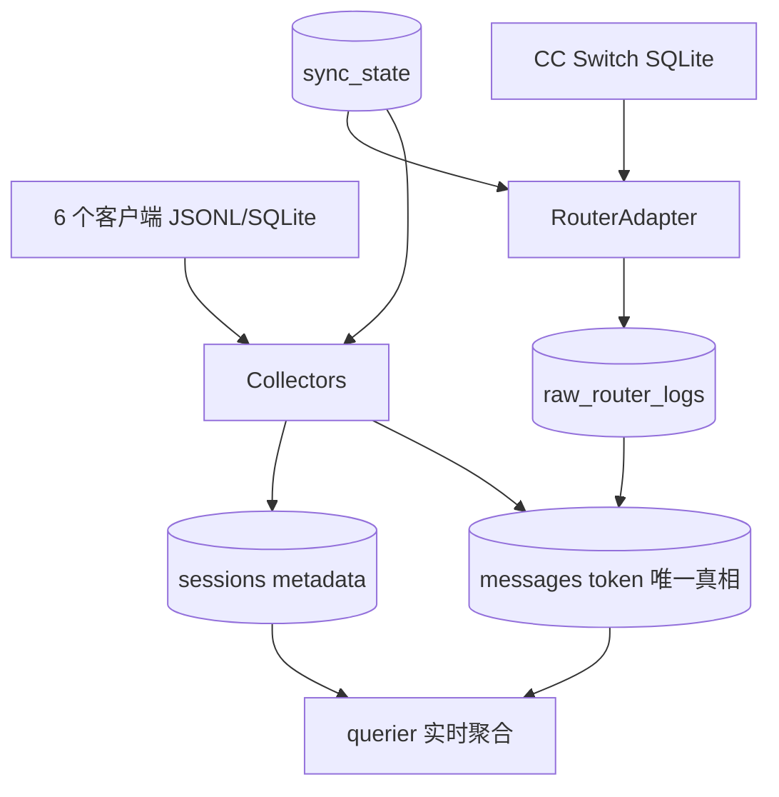

# 架构设计

> 简体中文 | [English](architecture.md)

## 快速概览

**定位**：本地 LLM 使用数据统计工具，采集、分析和查询各 AI 客户端的 token 使用情况。单二进制分发，支持 macOS 与 Windows。

**技术栈**：

| 层 | 组件 |
|----|------|
| 语言 | Go |
| CLI | `spf13/cobra` |
| 配置 | `spf13/viper` + `pelletier/go-toml/v2`（读取 TOML 注释；`config set`/TUI 保存会完整重写配置，不保留注释） |
| 数据库 | `modernc.org/sqlite`（纯 Go SQLite，无需 CGO） |
| 文件监控 | `fsnotify/fsnotify` |
| 文件锁 | `gofrs/flock` |
| TUI | `charmbracelet/bubbletea` + `bubbles` + `lipgloss` |

**采集粒度**：消息/API 请求级。每次实际模型调用独立入库为一条 `messages` 行，不再按会话聚合 token。

**核心模块**：

| 目录 | 职责 |
|------|------|
| `cmd/token-usage/` | 程序入口（`main.go`，仅装配 root cmd 并 `Execute`；error → 退出码 1） |
| `internal/buildinfo/` | 规范化版本与构建元数据（`Current()`/`Info.Short()`/`Info.Detail()`，供 `version` 命令与 `--version` flag 复用同一份快照） |
| `internal/cli/` | Cobra 命令组装配（config/collect/query/errors/start/status/stop/restart/version、内置 completion + Hidden `_run`） |
| `internal/configapp/` | 配置应用层：`ApplyConfig` 在 control lock 内原子编排（revision 保护、写盘、自启同步、动作建议）；`AnalyzeConfigEffects` 影响矩阵 |
| `internal/runtimecfg/` | 配置解析边界：`LoadEffectiveConfig`（展开 `~`、补默认值、补 registry 默认路径）、`ValidateUserConfig`、用户层 snapshot |
| `internal/config/` | 用户配置读写、dotted key get/set、默认模板。`[query]` 段以 raw 载体原样保留（`RawQuery` 与互斥的 `RawQueryTopLevelIssues`），全局加载链不做 query 语义校验 |
| `internal/querydef/` | 纯函数解析器：raw query 状态 → 已校验只读定义（内置维度、子查询、组合查询、默认视图与 `[query.output]` 列布局）；提供一次完整 `Parse` 与两个互相隔离错误的局部入口（`ParseViews` 只读视图定义、`ParseOutputLayout` 只读输出布局，共享顶层问题共同前置）；错误为结构化 `ValidationError` 诊断（稳定路径 + 封闭类别集合）。不读文件不碰 DB，`internal/config` 不依赖它 |
| `internal/control/` | 进程控制层：control lock、`Manager` 的 Start/Stop/Restart/Inspect、父子 control lease |
| `internal/daemon/` | 守护进程主体：daemon lock、PID、detached spawn、`startupCoordinator`（monitor ready → catch-up） |
| `internal/runmeta/` | 守护进程双文件元数据协议：PID 文件 + runtime-state JSON |
| `internal/fileutil/` | 跨平台「完整文件替换」`ReplaceCompleteFile` 与 temp 清理 |
| `internal/service/` | 跨平台开机自启服务定义管理（macOS launchd / Windows 注册表），定义层与运行层解耦 |
| `internal/update/` | 自更新核心（非 CLI）：版本解析、平台资产映射、`SHA256SUMS` 清单、GitHub Release 查询、下载、来源校验、安装编排。不依赖 `internal/cli` |
| `internal/model/` | 数据模型（Message、Session、SyncCursor、RouterLog 等） |
| `internal/db/` | SQLite 连接、Schema 迁移、各表 DAO |
| `internal/collector/` | 采集引擎（6 个 client collector + CC Switch router adapter） |
| `internal/engine/` | 采集编排（依赖装配、主循环、事务化写入、重试、结果校验） |
| `internal/analyzer/` | 守护进程实时监控（JSONL watcher、SQLite poller、debounce、串行化锁） |
| `internal/querier/` | 查询引擎（从 messages 实时聚合） |
| `internal/tui/` | 配置交互编辑 TUI（bubbletea；保存经 `ApplyConfig`） |
| `internal/logger/` | 基于 log/slog，按天轮转，自动清理 |

**数据源**：

| 客户端 | 数据源类型 | 默认路径 |
|--------|-----------|---------|
| Claude Code/Desktop | JSONL（全量按文件扫描） | `~/.claude/projects` |
| OpenCode | SQLite（message + event 双源） | `~/.local/share/opencode/opencode.db` |
| Codex | SQLite state DB（token 主源）+ rollout JSONL（辅助，解析层重播去重） | `~/.codex`、`~/.codex/sessions` |
| WorkBuddy | JSONL（主源）+ SQLite（仅查 title） | `~/.workbuddy/projects`、`~/.workbuddy/workbuddy.db` |
| ZCode | SQLite | `~/.zcode/cli/db/db.sqlite` |
| Zhipu-AutoClaw | JSONL（全量按文件扫描） | `~/.openclaw-autoclaw/agents` |

**路由中间件**：

- **CC Switch**（`RouterAdapter`）：查询 CC-Switch 的 `proxy_request_logs` + `providers` 表，为 messages 回填真实 provider/model。当前 `app_type` 仅识别 `claude` / `claude-desktop`，其他客户端的原始日志仍写入 `raw_router_logs` 但不参与消息级归因。

## 数据流

`messages` 是 token 的唯一真相源，`sessions` 只保存元数据（directory/project/title/parent_id/first_ts/last_ts），不存储 token 列。查询从 `messages` 实时聚合，不依赖物化汇总表。



**说明**：

- Collectors 读取 6 个客户端源，输出 `[]model.Message` + `[]model.Session`，在单事务内写入 `messages` 和 `sessions`。
- RouterAdapter 读取 CC Switch SQLite，输出 `[]model.RouterLog`，写入 `raw_router_logs`；随后按 `message_id` 查询归因，把 `router_provider/router_model/router_name` 回填到 `messages`。对已配置 router 且支持归因的 client，其采集轮在 messages 入库后同样按 `message_id` 查询已入库的 `raw_router_logs` 行回填——不限于 CLI 日期模式，daemon 轮因此覆盖「router 日志先入库、message 后入库」的交错。
- `sync_state` 记录每个 client 各 source 的增量游标，collector 和 router adapter 各自读写自己的 source。
- 全量采集（`collect all`）传入 `Dates=nil`，不使用 `collection_log` 的日期去重；`messages` 按 `(client, id)` UPSERT，因此可安全重复扫描。
- collector 部分源失败时，已成功解析的消息、会话和 router 数据仍事务落库，但不写 `collection_log`、不解决历史错误、不推进 `sync_state`；后续普通采集或 retry 会按幂等 UPSERT 重放仍有缺口的区间。
- 查询层（querier）直接 JOIN `messages`（+ `sessions` 元数据）实时聚合，无中间汇总表。全部分组视图共用一条维度化管线（维度 → 原始聚合 → alias 合并后的复合键 → 稳定排序 → 表格），末行输出同一日期范围独立聚合的 `Total / 总计`；会话明细与总览摘要不追加。供应商别名在组合键形成前合并行，不回写 `messages`。每张表的指标列由同一组按全局 `[query.output]` 布局解析出的有序指标描述符渲染（默认七列；`cache_create` 可选但默认隐藏）——表头、分组行、总计行与会话行遍历同一描述符，`cache_hit` 始终读取含 `cache_create` 的完整聚合值，布局只改显示，不改统计、排序与总计。
- 裸 `query` 执行 `[query]` 配置的默认对象（未配置回退 client）；`query <name>` 在根命令上按位置参数分派到具名子查询/组合查询，与显式写法 `query custom <name>` 共用同一条具名执行链；`query list` 只依据已解析定义渲染配置视图，绝不打开数据库。定义名称为小写标识符，不能与 `client`/`model`/`provider`/`project`/`session`/`summary`/`custom`/`list` 冲突。语义校验只发生在这些路径（默认、直接/显式具名、list）与 TUI 保存前，由 `internal/querydef` 完成完整解析——无关的视图定义错误不阻塞五个受布局影响的静态表格命令，它们经隔离的 `ParseOutputLayout` 入口解析布局（合法布局仍生效；`query.output` 自身在开库前使它们失败；顶层 query 问题静默回退默认列）。`query summary` 不读取布局。query 配置无效不会阻塞采集、status、守护进程、`config set` 与 `config show`，它们继续透传并原样写回问题项。
- Codex rollout 解析器仅在事件含有效 `total_token_usage` 时，以同一 `limit_id` 最近签名或紧邻 token 事件的完整 `(total,last)` 签名识别重播；不做全表去重，以保留合法计数器重置。去重只影响本次内存解析，不会自动清理既有数据库中的历史重复消息。

## 数据库表

Schema 位于 `internal/db/schema.go` 的 `migrateV1`（user_version=1）。

| 表 | 用途 |
|----|------|
| `messages` | token 账本主表，按 (client, id) 主键存逐请求 token |
| `sessions` | 会话元数据（client/directory/project/title/parent/时间），不含 token 列 |
| `sync_state` | 增量同步游标，按 (client, source) 存 cursor_value + cursor_id |
| `raw_router_logs` | 路由中间件 staging 表，存原始 RouterLog 用于归因回填 |
| `collection_log` | 采集完成记录，按 (date, source) 标记已采集日期与消息数 |
| `collection_errors` | 采集失败记录，带 retry_count/resolved 状态 |
| `file_scan_log` | 文件扫描断点（mtime/size/last_line_offset） |
| `raw_client_sessions` | 旧版 session staging 表，当前生产路径不使用 |

### messages 表 token 字段

| 列 | 含义 |
|----|------|
| `input_tokens` | 原始 input（含 cache） |
| `fresh_input_tokens` | 扣除 cache 后的真正 fresh input（WorkBuddy/ZCode/Codex 由 `model.SubtractCache` 计算；AutoClaw/Claude/OpenCode 的 input 已是 fresh，直接取 input 不扣减） |
| `output_tokens` | 输出 token |
| `cache_read_tokens` | 缓存命中读取 |
| `cache_create_tokens` | 缓存创建写入 |
| `reasoning_tokens` | 推理 token（明细） |
| `total_tokens` | 总计 token |

查询聚合时直接 SUM `fresh_input_tokens` 与 `total_tokens`，取源值、不按 client 推断、不叠加 reasoning。

## 模块职责

| 模块 | 职责 | 关键接口 |
|------|------|----------|
| `buildinfo/` | 规范化版本与构建元数据：注入变量 → `debug.BuildInfo`/VCS 降级 → `dev`/`unknown`；供 version 子命令与 `--version` flag 复用 | `Current()`, `Info.Short()`, `Info.Detail()` |
| `cli/` | Cobra 命令组装配（含 version/config show）；start/stop/status/restart 经 `control.Manager`，config set/TUI 经 `configapp.Application` | `NewRootCmd()` |
| `configapp/` | 配置应用层：`ApplyConfig` 锁内原子编排（revision 保护、写盘、自启同步、stale 清理、动作建议）；`AnalyzeConfigEffects` 影响矩阵 | `Application.ApplyConfig()`, `AnalyzeConfigEffects()`, `Revision()` |
| `runtimecfg/` | 配置解析边界：effective 解析、校验、registry 默认路径、用户层 snapshot | `LoadEffectiveConfig()`, `ResolveEffectiveConfig()`, `ValidateUserConfig()`, `ConfigPath()` |
| `control/` | 进程控制层：固定 control lock + Start/Stop/Restart/Inspect + 父子 lease | `Manager.Start/Stop/Restart/Inspect()`, `WithLock()`, `ParseParentLease()` |
| `daemon/` | 守护进程主体、daemon lock、PID、detached spawn、startup catch-up | `Run()`, `AcquireLock()`, `IsDaemonRunning()`, `SpawnDetached()` |
| `runmeta/` | 双文件元数据协议：PID + runtime-state，完整文件替换 | `WritePIDFile()`, `WriteRuntimeState()`, `ReadPIDFile()`, `CleanupStaleMetadata()` |
| `fileutil/` | 跨平台完整文件替换 + temp 清理 | `ReplaceCompleteFile()`, `CleanupKnownTempFiles()` |
| `service/` | 跨平台开机自启定义管理（定义层与运行层解耦） | `SyncWith()`, `AutoStartManager.Status()`, `StopCurrent()` |
| `update/` | 自更新核心（非 CLI）：版本解析、平台资产映射、`SHA256SUMS` 清单、GitHub Release 查询、下载、来源校验、安装编排。直接 import `config`/`control`/`fileutil` 与标准库，`buildinfo` 版本字面量与 `runtimecfg` effective 配置经 seam 注入；**不**依赖 `internal/cli`，CLI 只解析参数、装配依赖、格式化结果 | `Service.Check()`, `Service.Apply()`, `ParseVersion()`, `ParseManifest()`, `AssetName()`, `VerifyProvenance()` |
| `config/` | 用户配置读写、dotted key get/set、默认模板 | `LoadUserConfigAuto()`, `Set()`, `Get()`, `MarshalUserConfig()`, `DefaultConfigTemplate()` |
| `model/` | 定义 Message、Session、SyncCursor、RouterLog 等共享结构体 | `Message`, `Session`, `SyncCursor`, `SubtractCache()` |
| `db/` | SQLite 连接管理、Schema 迁移、各表 DAO | `Open()`, `UpsertMessages()`, `UpsertSessionMeta()`, `SetSyncCursors()`, `QueryRouterLogsByMessageIDs()`, `BackfillRouterFields()` |
| `collector/` | 从各数据源解析原始数据，输出 `CollectResult` | `Collector.Collect()`, `RouterAdapter.CollectLogs()` |
| `engine/` | 采集编排：依赖装配、主循环、事务化写入、重试、结果校验 | `NewDeps()`, `RunCollect()`, `RunRetryWithDeps()`, `RunRouterBackfill()`, `ValidateResult()` |
| `analyzer/` | 守护进程监控：ChangedFile/Incremental/router source 触发采集，debounce 合并，串行化锁 | `NewFromConfig()`, `JSONLWatcher`, `SQLitePoller` |
| `querier/` | 从 messages 实时聚合查询，格式化输出 | `ByClient()`, `ByModel()`, `ByProject()`, `RunDimensionView()`, `Sessions()`, `Summary()` |
| `tui/` | 配置交互编辑 TUI（双模型 edit/display + 手动保存经 `ApplyConfig` + 自启 toggle） | `Run()` |
| `logger/` | 基于 log/slog，按天轮转，自动清理 | `Init()` |

## 运行模式

### CLI 模式（单次执行）

```
用户执行命令 → 加载配置 → 执行采集/查询/配置编辑 → 输出结果 → 退出
```

命令组：`version`（多行详细输出）、Cobra 内置 `completion`、`config`（交互式 TUI，子命令 `show`/`init`/`get`/`set`）、`collect`（子命令 `all`/`router`/`retry`）、`query`（子命令 `client`/`model`/`provider`/`project`/`session`/`summary`，另加 `custom <name>` 与只读的 `list`）、`errors`、`start`、`status`、`stop`、`restart`，以及 Hidden 内部命令 `_run`。根命令另带 `-v, --version` flag（单行短输出）。

直接执行 `token-usage`（不带任何参数）只会打印帮助信息，既不启动 TUI 也不启动守护进程。命令树、参数、标志、退出码与示例的完整参考见 [CLI 参考](cli.zh-CN.md)。

适用场景：手动触发、cron 定时任务、脚本集成。

### 守护进程模式（实时监控）

```
start spawn 拉起 _run → 父子 lease 授权 → child 获 daemon lock → 启动监控 goroutine
                            │                  + 启动 startupCoordinator
                            ├── fsnotify 监控 Claude JSONL（ChangedFile source）
                            ├── fsnotify 监控 Codex rollout JSONL（ChangedFile source）
                            │   + 定时轮询 Codex state DB（Incremental source）
                            ├── fsnotify 监控 WorkBuddy JSONL（ChangedFile source）
                            ├── 定时轮询 OpenCode DB（Incremental source）
                            ├── 定时轮询 ZCode DB（Incremental source）
                            └── 定时轮询 CC Switch DB（router source）
```

适用场景：实时查看使用情况、后台持续监控。

**触发语义**（由 `CollectRequest` 字段区分）：

- **ChangedFile**：JSONLWatcher 触发（fsnotify 监听 `.jsonl` 变化，debounce 合并高频写事件），只扫描变更的单个文件。覆盖 claude / codex sessions / workbuddy projects / autoclaw agents。
- **Incremental**：SQLitePoller 触发（定时轮询 mtime，WAL 模式取 max(db, -wal)），按 `sync_state` 游标增量读取。覆盖 opencode / zcode / codex state DB。
- **router source**（`Source=router`）：router DB poller 触发，只补 router 字段，不调用 client collector。按启用且声明 Router 的 client 配置装配（当前只有 `cc_switch` case）。

对已配置 router 且支持归因的 client，每个采集轮（ChangedFile / Incremental / CLI 日期模式）在 messages 入库后同样按 `message_id` 查询已入库的 `raw_router_logs` 行回填归因——router 日志先于 message 到达时（router 轮的 UPDATE 落空且 cursor 已推过），归因仍能补上。未配置 router、或持存量非 Claude router 配置的 client 轮既不查表也不回填；存量配置仍只写原始日志。

WorkBuddy 的 SQLite 仅用于 title 查询，不建 poller。

**并发保护**：CLI 的 collect 与守护进程通过 daemon lock（`<data_dir>/token-usage.lock`）互斥，避免同时写 SQLite——collect 在打开数据库前预检 daemon lock，运行中则拒绝采集；守护进程内串行化锁保证所有采集顺序执行。start/stop/restart/config set 则通过 control lock 串行化控制操作（见下文）。

## 进程控制架构

守护进程的控制涉及两把锁、一套父子 lease、双文件元数据与完整文件替换契约，共同保证「定义层与运行层解耦」且「控制操作原子」。

### control lock 与 daemon lock

| 锁 | 路径 | 持有期 | 用途 |
|----|------|--------|------|
| **control lock** | 固定 `~/.token-usage/token-usage.control.lock` | 短期（数百毫秒~秒级） | 串行化 start/stop/restart/`ApplyConfig` 等控制操作；路径固定不随 `data_dir` 变化，控制信号与数据目录解耦 |
| **daemon lock** | `<data_dir>/token-usage.lock` | 长期（守护进程生命周期） | 守护进程**存活唯一真相源**；持有即「在运行」 |

二者是不同概念，不在同一进程中直接嵌套抢锁：

- `control.Manager` 在 control lock 内通过 `daemon.IsDaemonRunning(lockPath)` **只检测** daemon lock（不抢锁、不探测进程），据此决定 spawn/stop/inspect。
- `_run` 子进程在 daemon lock commit 后才视为启动成功；control lock 的获取/释放与 daemon lock 分离。
- control lock 抢锁等待上限 15s（100ms 轮询）；context 主动取消返回 `Canceled`，超时（自身或传入 context 的 deadline）统一映射为 `ErrControlLockTimeout`，便于调用方统一判断。

### 父子 control lease（避免 start 死锁）

`start`/`restart` spawn `_run` 时，父进程持 control lock（约 5s 等 ready），若 child 也需获取 control lock 会形成死锁。父子 lease 解决该问题：

- 父进程（`start`/`restart`）在持 control lock 时生成一次性 `instanceID`，创建匿名单向 pipe；父持 write end，child 继承 read end（POSIX 经 `os/exec` 的 `ExtraFiles` 传递 fd，Windows 经可继承 handle）。pipe 不传业务数据，read end 的 EOF 只表示「父级 control lease 已消失」。
- `instanceID` + read end 标识经三个内部环境变量传递（`TOKEN_USAGE_START_INSTANCE` + POSIX `TOKEN_USAGE_LEASE_FD` / Windows `TOKEN_USAGE_LEASE_HANDLE`）；spawn 前会先从 child env 过滤这些内部变量，避免残留误判。
- child 启动 lease watcher 阻塞读 read end；watcher 与 daemon-lock 获取路径经同一互斥状态机（`LeaseStateMachine`）提交：
  - EOF 先发生且 daemon lock 未获得 → child 取消启动，不写 PID/runtime-state，退出码 0（`ErrParentLeaseLost`）。
  - child 先获取 daemon lock（commit）→ 之后 EOF 只表示父命令结束，不再停止 daemon。

两条 `_run` 启动路径都满足不变量「从读取 effective config 到获取 daemon lock 期间始终存在 control lease」：

- **父 lease 路径**（`start` spawn 的 `_run`）：父进程持 control lock 授权 child，child 不抢锁。
- **独立路径**（launchd/注册表直接拉起）：无合法父 lease 时自行获取 control lock（15s 超时）；超时则成功退出码 0 不进入主循环，避免与正在进行的控制操作冲突，并在 macOS 上避免 launchd KeepAlive 立即重拉。

### 双文件元数据（PID + runtime-state）

daemon lock 是存活唯一真相源，PID/runtime-state 是**可降级**的定位/状态元数据：读失败由调用方降级（status 显示「PID 元数据不可用」/「启动阶段未知」；start/stop 走安全错误），绝不返回「ready」半成品。

| 文件 | 路径 | 内容 |
|------|------|------|
| PID 文件 | `<data_dir>/token-usage.pid` | 文本 `"<pid> <instanceID>"`（兼容旧 `"<pid>"`，但旧格式不满足 instanceID ready 握手） |
| runtime-state | `<data_dir>/token-usage.runtime.json` | `RuntimeState` JSON：`pid`/`instance_id`/`monitor_ready`/`catch_up`/`catch_up_failures` |

`control.Inspect` 组合「daemon lock 判活 + runmeta 读 PID/state」：仅当 runtime-state 的 PID+instanceID 与 PID 文件全匹配时 `PhaseAvailable=true`（启动阶段可信），否则降级。阶段信息只用于展示，不参与 autostart 漂移判断。

清理分两种：`CleanupStaleMetadata`（确认 daemon lock 未持有时按 stale 协议清理 PID+state+精确 temp）、`CleanupOwnedMetadata`（确认 instanceID 所有权后正常退出清理，PID 与 state 分独立判断归属，防止 PID 复用误删他代文件）。

### 完整文件替换契约

所有元数据/配置的持久化写入统一经 `fileutil.ReplaceCompleteFile`，避免半写/撕裂：

- 在 target **同目录同卷**创建 temp（`.<base>.tmp-*`），写完整 bytes 并 `Sync`/`Chmod`/`Close` 后再原子替换。
- POSIX 用同目录 `rename`；Windows 用 `MoveFileEx` + `MOVEFILE_REPLACE_EXISTING`。
- 调用方不能传入 temp 路径或替换底层操作；任一步失败都尝试清理 temp，replace 与清理同时失败用 `errors.Join` 保留主因。

该契约覆盖：PID 文件、runtime-state、`config.toml`（`ApplyConfig` 写盘）。残留 temp（如崩溃）由 `CleanupKnownTempFiles` 按**精确 basename 前缀**清理（不删近似名/目录/symlink target），在持锁路径调用。

### 运行态（`start`/`stop`/`restart`/`status`）

`start`：control lock 内 load config → 以 daemon lock 判活 → 已运行幂等返回 PID → 未运行 detached spawn `_run`（含父 lease）→ 等六项 ready 条件（PID 文件的 PID/instanceID、daemon lock、runtime-state 的 PID/instanceID/monitor_ready）全部成立（5s 轮询）→ 成功；超时尽力终止本次子进程，仅在 lock 已释放且归属仍匹配时清理元数据。

`stop`：control lock 内 load config → daemon lock 判活 → 未运行幂等返回 → 运行中按平台停止（macOS：始终先幂等尝试当前 label 的 bootout，lock 仍持有时再对准确 PID 发 SIGTERM；Windows：taskkill 精确 PID）→ **以 daemon lock 释放**为成功条件（5s 轮询），不靠删 PID 文件伪装成功。

`restart`：单次 control lock 内 stop 旧 + start 新；未运行返回 `ErrRestartNotRunning`（提示用 `start`）。macOS 取舍：bootout 后新进程以 detached 方式运行，本次登录会话失去 KeepAlive；plist 仍保留，并在下次登录时重新加载。重新保存配置只维护定义文件，不会主动 bootstrap 当前 job。

`status`：只读（`Inspect` 不抢 control lock），返回一致快照：运行状态 + 启动阶段 + 数据目录/轮询间隔 + 开机自启漂移检测（5 态）。

### 自启态（定义层与运行层解耦）

`internal/service` 把开机自启拆为两层：

- **定义层**（`SyncWith` / `AutoStartManager.Status`）：只写/删服务定义文件，**绝不碰当前进程**。
  - macOS：`~/Library/LaunchAgents/` 下的 LaunchAgent plist（不调 `launchctl bootstrap`，登录时自动加载）。
  - Windows：注册表 `HKCU\...\Run` 键值（不 spawn，Disable 不 taskkill）。
- **运行层**（`start` / `stop` / `restart`）：只管控当前进程——`start` 显式 detached spawn，`stop` 显式停止（保留定义）。

`config set daemon.autostart` 与 TUI 保存都经 `ApplyConfig` 触发幂等收敛 `service.SyncWith`，**不会因翻转自启开关而启停当前守护进程**：开启只写定义（当前不变，下次登录生效），关闭只删定义（当前继续运行，下次不再自启）。要让当前会话生效需手动 `stop` + `start`（或 `restart`）。

**漂移检测**：`status` 只读对比配置（autostart 开/关）与服务实际状态（`Exists` + `SpecMatches`），区分「已启用 / autostart=开但定义缺失 / 内容不一致 / autostart=关但定义残留 / 未启用」5 态，只提示「建议重新保存配置」，不触发任何写操作。

### ApplyConfig（配置应用编排）

`configapp.Application.ApplyConfig` 是 `config set` 与 TUI 保存的共用入口，在 control lock 内原子完成十步：清理 config temp → 重读 raw 算 revision 与 expectedRevision 比较（不一致 → `ErrConfigChangedExternally`，本次不写）→ 解析 previous/current effective → 校验 + data_dir 迁移前置 → Inspect 运行状态 → Marshal 一次并按 raw 是否变化决定写盘/no-op → `service.SyncWith` 同步自启定义（失败进 PartialErrors 不回滚）→ data_dir 变化时清理旧 stale metadata → `AnalyzeConfigEffects` 生成动作建议 → 释放锁。

**配置影响矩阵**（`AnalyzeConfigEffects`）按 effective config 变化输出：

- client disabled→enabled / 路径变化 → `collect all --client X`（新版 `collect all` 已含 router 阶段，同一 client 不重复进 router 列表）。
- client router 变化（空→R 或 R1→R2）或 router db_path 变化 → 受影响已启用且配 router 的 client 执行 `collect router --client X`。`provider_aliases` 变化仅影响查询展示，不触发采集或 router 回填。
- daemon poll_interval / log 字段 / 任一 client-router-path 变化（不含纯 autostart）→ `RuntimeChanged`（运行中需 restart）。
- 仅 `daemon.autostart` 变化 → **不算** runtime changed（只影响下次登录定义）。

**动作建议**（按运行态合并）：daemon 运行中且有 collect → `stop` → 全部 collect → `start`；运行中仅 RuntimeChanged → `restart`。警告（旧路径历史不删、router 重绑旧关联不清理等）作为说明输出。

**stdout/stderr 合同**：成功稳定行 `✓ <key> = <value>` 写 stdout；动作建议、说明、warning 写 stderr。revision 冲突（stdout 不写成功行、退出非零，重试自动重读）与部分失败（配置已落盘但同步/清理失败，stdout 仍写成功行、stderr 写失败、退出非零）均按合同输出。data_dir 迁移需 `--confirm-migrate` 且旧 daemon 已停。

**只读 effective 读取链路**：`config show` 复用 `cli.loadConfig()` → `runtimecfg.LoadEffectiveConfig`（即 `LoadUserConfigSnapshot` → `ValidateUserConfig` → `ResolveEffectiveConfig` 的单一解析边界），序列化为 TOML 写 stdout。它不复制默认值逻辑，只读、零运行时副作用——不创建 config/DB/日志/daemon 元数据、不抢进程锁、不同步自启。`config get` 则只读用户配置层原值（不展开 `~`、不补默认值），与 `config show` 的 effective 解析路径区分。

### startup catch-up（关闭 stop→collect→start 数据窗口）

`daemon.startupCoordinator` 串联 monitor ready → runtime-state → catch-up，保证 stop→collect→start 之间产生的增量数据不遗漏：

1. 等待 analyzer 所有 monitor 就绪（ready barrier）；ctx 取消则不写 state、不 catch-up。
2. 写 ready state（`monitor_ready=true, catch_up=pending`）；失败回传 fatal，daemon 立即取消 analyzer。
3. 写 running state（`catch_up=running`）；失败时记录日志，不停 daemon，并继续 catch-up。
4. 顺序 Submit catch-up（经 analyzer 串行化锁，与实时触发同一路径）：按已启用 client 名升序，每个 client 先发 client-source 请求（opencode/zcode 增量 cursor；claude/workbuddy/autoclaw 无日期扫现存 JSONL；codex 先 state 增量再 rollout 全扫），再发该 client 的 router 增量请求（若配置）。任一失败只累计该请求一次，不跳过后续。
5. 写 final state：0 失败 = `succeeded`，否则 = `failed` + 准确失败数；失败不停 daemon。

catch-up 覆盖「最后一次手工 collect 到监听 ready」的窗口，因此只要 daemon 成功启动并完成 catch-up，期间产生的增量会被补采。catch-up 部分失败会在 `status`（`catch_up=failed`）与 `errors` 中体现。

## 自更新架构

`internal/update` 承载自更新核心。`update` CLI 命令只解析参数、装配依赖、格式化结果——经窄接口 `Check`/`Apply` 调用 `update.Service`。该包直接 import `config`、`control`、`fileutil` 与标准库，`buildinfo` 版本字面量与 `runtimecfg` effective 配置经 seam 注入而非直接 import；**不**依赖 `internal/cli`，使核心可在无 cobra 环境下测试。

### 官方来源验证

唯一受信仓库为 `YuLaiZ/token-usage`。下载 URL 由固定前缀 + 已验证 tag + 预期资产名重构，不信任 Release JSON 的 `browser_download_url`。所有 HTTP 强制 HTTPS、固定 `User-Agent`、有限超时、响应大小上限、状态码检查。

### 更新信任链

若同目录已存在受限的 POSIX 事务 journal，`Apply` 会在版本比较和来源校验之前先处理该本地事务。这一路径不引入新二进制或下载：路径由当前 executable 与 journal nonce 推导，恢复会重新校验已记录的 hash 后才恢复一致的文件和 daemon 状态。

对于新的二进制替换，一次运行只有在每一环都成立时才继续：

1. 请求的 tag 严格解析（`vMAJOR.MINOR.PATCH[-rc.N]`，无前导零）。
2. 目标版本严格高于当前版本。
3. 校验当前二进制来源——其 SHA256 必须等于当前版本的官方资产 hash。当前为 `dev`/伪版本、非普通文件或 symlink、或 hash 不匹配，即判定来源不可信，输出人工安装指引而不覆盖。其中 hash 失配（如已重签的二进制或 `go install pkg@vX.Y.Z` 产物）与 dev 本地构建可经 `--force` 显式覆盖：结构前置与目标资产校验照常执行，consume/sweep 仍仅可信来源执行，结果标记为 forced 而绝不标记为 trusted。软链副本与非官方 tag 不可被 force。
4. 下载目标资产并流式 SHA256，与 `SHA256SUMS` 清单（`ParseManifest`）比对。
5. stage 后的二进制用 `--version` 二次校验通过后才允许替换在用二进制。
6. 替换在 control lock 内完成（见下文）。

默认只选择最新**稳定** Release；只有显式 `--version v…-rc.N` 才会触达预发布版。

### 事务与 daemon 协调

`control.Session` 提供 lock 内 `Stop` 与 `StartWithExecutable`（后者取显式新 target 路径）。`update` 在同一 control lock 回调内执行 `Inspect` →（若运行则）`Stop` → install →（若原运行则）`StartWithExecutable`，或回滚 restart。它**不**在 lock 回调内嵌套调用 `Manager.Start`/`Stop`/`Restart`，以避免自死锁。`update --check` 不创建 `control.Manager`、不获取 control lock、不创建 `~/.token-usage` 配置目录。

### POSIX 与 Windows 替换差异

- **POSIX**：同目录原子 rename。installer 写 backup → rename 新二进制到位 → `fsync`，失败回滚；中断的运行会在下一次 `update` 调用按 journal 恢复。
- **Windows**：分阶段替换（staged replacement）。父进程（运行中的 `update`）写 helper plan、复制隐藏 helper.exe、捕获父进程身份、spawn 隐藏 helper；父进程随后返回 sentinel `ErrDeferredToHelper`。`Apply` 将其传递为 `ApplyResult.Deferred`，因此 CLI 能明确说明「后台替换已排队」，而不会与安装未完成混淆。父进程退出后，helper 取 control lock、用 `MoveFileEx` 替换运行中的 `.exe`、按需重启 daemon 并写 result；cleanup 步骤（新 target 上的隐藏命令）等 helper 退出后清理临时文件。helper 经显式进程身份（PID + 创建时间）等待父/helper 退出，避免 PID 复用 TOCTOU。`_update-helper` 与 `_update-cleanup` 是隐藏内部命令（`--help` 不可见），勿直接调用。

Windows staged replacement 已实现（代码经 `update.NewWindowsInstaller()` 与 helper runner 接线），但实机验收在发布候选（RC）阶段进行；因此 Windows 上命令报告异步结果，绝不声称已完成。

## 包依赖

依赖方向自上而下，禁止反向依赖：

```text
cmd/token-usage → cli

cli → control / configapp / runtimecfg / daemon / config / querier / engine / collector / db / logger / buildinfo / update
tui → configapp / runtimecfg / config
configapp → control / runtimecfg / service / fileutil / config
control → daemon / runmeta / runtimecfg / config
daemon → runmeta / fileutil / analyzer / engine / db / logger
update → control / config / fileutil（buildinfo 版本字面量与 runtimecfg effective 配置经 seam 注入，不直接 import）
runmeta → fileutil
runtimecfg → config
buildinfo → 标准库（runtime / runtime/debug）
fileutil → 标准库（+ Windows 经 golang.org/x/sys）
```

要点：

- `cli` 是装配顶层；`tui` 不直接 import `control`/`service`（经 `configapp` 的 `ApplyFunc` 解耦）。
- `cli → buildinfo`：根命令装配处调用一次 `buildinfo.Current()` 取快照，供 `--version` flag 与 `version` 子命令共享。`buildinfo` 是叶子包（仅依赖标准库），不被任何底层业务包反向引入。
- `cli → update`：`update` 命令经窄接口 `Check`/`Apply` 装配真实 `*update.Service`；`update` 直接依赖 `control`/`config`/`fileutil`，`buildinfo` 版本字面量与 `runtimecfg` effective 配置经 seam 注入。`update` 不 import `internal/cli`，使自更新核心可在无 cobra 环境下测试。
- `control` 依赖 `daemon` 的 lock 判活与 detached spawn（`daemon.IsDaemonRunning` / `daemon.SpawnDetached`），但不调用 `daemon.Run`。
- `runmeta`/`runtimecfg`/`fileutil`/`buildinfo` 是底层叶子包，避免反向引入业务包。
- 完整文件替换（`fileutil.ReplaceCompleteFile`）是 `runmeta`/`configapp` 的共享持久化契约。

## CLI 命令

命令级细节（参数、标志、退出码、示例）见 [CLI 参考](cli.zh-CN.md)。各命令实现位置：

| 命令 | 实现位置 |
|------|----------|
| `version`（子命令） + `--version`/`-v`（flag） | `internal/cli/version.go` + `internal/cli/root.go`（`buildinfo.Current()` 在 root 装配处取一次） |
| `completion <bash|zsh|fish|powershell>` | Cobra 内置命令，向 stdout 生成 Shell 补全脚本 |
| `collect` / `collect all` / `collect router` / `collect retry` | `internal/cli/collect*.go` |
| `query` / `query <name>` / `query custom <name>` / `query list` | `internal/cli/query.go`（维度聚合在 `internal/querier`，视图定义在 `internal/querydef`） |
| `errors` | `internal/cli/errors.go` |
| `config` / `config show` / `config get` / `config set` / `config init` | `internal/cli/config_tui.go` / `config_show.go` / `config_get.go` / `config_set.go` / `init.go` |
| `start` / `stop` / `restart` / `status` | `internal/cli/{start,stop,restart,status}.go` |
| `update` / `update --check` / `update --version` / `update --force` | `internal/cli/update.go`（核心在 `internal/update`；隐藏的 `_update-helper`/`_update-cleanup` 在 `internal/cli/update_helper*.go`） |
| `_run`（Hidden） | `internal/cli/run_internal.go` |

> 历史变更：原 `token-usage run --daemon` 命令已删除，由 `start` + Hidden `_run` 取代。旧版用户脚本需迁移至 `token-usage start`。

## 配置

配置文件路径：`~/.token-usage/config.toml`，TOML 格式，可手工添加注释。`config set` 与 TUI 保存使用 `go-toml/v2` 完整重写用户配置，因此不保留原有注释或 map 键书写顺序。

所有客户端默认关闭：用 `clients.<name>.enabled = true` 开启需要的客户端，数据源路径由 `runtimecfg` registry 按各工具默认位置统一填充；个性化时用 dotted key 同段写法覆盖默认。

下方示例展示的是客户端已启用状态；`config init` 生成的默认模板中所有客户端 `enabled = false`（`router` 行与 provider 别名均为注释示例）。

```toml
# 数据目录（数据库、日志、PID、锁存放位置）
data_dir = "~/.token-usage"

[clients.claude]
enabled = true
router = "cc_switch"          # 路由归因（当前仅 Claude 系列生效）

[clients.opencode]
enabled = true

[clients.codex]
enabled = true
# paths.state_dir = "~/.codex"  # dotted key 覆盖默认示例

[clients.workbuddy]
enabled = true

[clients.zcode]
enabled = true

[clients.autoclaw]
enabled = true

# 路由中间件（表名即实现类型，未来加新路由约定表名并在装配 switch 增 case）
[routers.cc_switch]
# db_path 不写即用默认 ~/.cc-switch/cc-switch.db

[provider_aliases]
"Zhipu AI Coding Plan" = "Zhipu GLM"

[daemon]
poll_interval = 30            # SQLitePoller 轮询间隔（秒）
autostart = false             # 开机自启（macOS launchd / Windows 注册表）

[log]
level = "info"
dir = "~/.token-usage/logs"
max_days = 7
```

> **路由归因现状**：当前只有 Claude（Code/Desktop）配置 `router = "cc_switch"` 会做消息级归因回填（`app_type` 仅识别 `claude` / `claude-desktop`）。配置入口会拒绝其他客户端设置非空 `router`（`config set` 直接报错，TUI 不提供该字段且保存校验拒绝）；存量配置中已存在的值读取不受影响——原始日志仍会写入 `raw_router_logs`，但 `MessageID` 为空、不回填 `messages`。新增其他客户端的路由归因需要日志协议解析、poller/cursor、`app_type→client` 映射和对应测试，不能仅靠配置自动接入。

`query provider` 先选用路由归因，再选用采集器值。历史空值保持未归因，查询不会依据客户端推断供应商。`provider_aliases` 将取得的供应商值映射为显示名。查询在选定有效供应商后应用别名并合并同名行；映射不会写入 `messages`，也不会触发重新归因。可通过 TUI 的 aliases 页面或 `config set 'provider_aliases."原始名"' '显示名'` 维护。

## 扩展性

### 添加新数据源

新增一个 client 采集器需要以下全部步骤，不能仅靠配置自动接入：

1. 在 `internal/collector/` 实现 `Collector` 接口（`Name()`、`SyncSources()`、`Collect(CollectRequest) CollectResult`）。
2. 在 `config/` 添加客户端配置结构，在 `defaults.go` 补默认路径。
3. 在 `internal/engine/deps.go` 的 `NewDeps` 注册采集器实例。
4. 在 `internal/analyzer/analyzer.go` 的 `setupFromConfig` 注册对应的监控源（JSONLWatcher 或 SQLitePoller）。
5. 设计日志协议（数据源结构）、poller/cursor 机制、`app_type→client` 映射（如涉及 router 关联）。
6. 补齐对应测试（collector 单元测试、daemon 集成测试）。

### 添加新路由中间件

1. 在 `internal/collector/` 实现 `RouterAdapter` 接口。
2. 声明 `RouterCapabilities`（provider/model/token 可用性）。
3. 在 `config/` 添加路由配置：约定其表名（如 `[routers.xxx]`），**表名即该路由的实现类型**（无冗余 `type` 字段）。
4. 改两处按表名分发的装配 switch：
   - `internal/engine/deps.go` 的 `NewDeps`（采集触发用）
   - `internal/analyzer/analyzer.go` 的 `setupFromConfig`（守护轮询用）
5. 若该路由要与某 client 做消息级归因，必须实现日志协议解析（`message_id` 提取）、`app_type→client` 映射、归因回填逻辑及对应测试。当前 `db.QueryRouterLogsByMessageIDs` 只识别 `claude`/`claude-desktop` 的 `app_type`。
6. 无需修改数据库层（共用 `raw_router_logs` 表）。

### 配置组合约束

- 全局可配置多个 router（`[routers.xxx]` 多段），但每个 client 当前至多选择一个 router（`clients.<name>.router` 单值）。
- 不支持多 router 链（router 串联 router）和预聚合/物化汇总表。

## 平台支持

| 平台 | 编译 | 守护进程 | 开机自启 |
|------|------|----------|----------|
| macOS（darwin） | ✅ | ✅ detached spawn（Setsid） | ✅ launchd LaunchAgent plist |
| Windows | ✅ | ✅ detached spawn | ✅ 注册表 `HKCU\...\Run` 键 |

交叉编译（`make build-all`）产 darwin（arm64/amd64）+ windows（amd64）。

### 构建

`make build`/`make build-all`/`make install` 三个 target 统一经 `-ldflags -X` 注入 `internal/buildinfo` 包的 `Version`/`Commit`/`BuildTime`（默认 `VERSION=dev`，当前无 Release tag）。`buildinfo.Current()` 在根命令装配处取一次快照，供 `--version`/`-v` flag 与 `version` 子命令共享。

未注入 ldflags 时按以下降级链解析（`debug.ReadBuildInfo`）：

- **version**：注入值 → `debug.BuildInfo.Main.Version`（`go install @version` 时由 module 版本提供）→ `dev`。
- **commit**：注入值 → `debug.BuildInfo` 的 `vcs.revision`（完整 revision，展示层截断前 12 位）→ `unknown`。工作树有改动（`vcs.modified=true`）追加 `-dirty`。
- **build_time**：仅取注入值；**不用 `vcs.time`**（那是 commit 时间，非构建时间）。直接 `go build` 未注入时 version 为 `dev`、build_time 固定为 `unknown`；commit 仍按上面的链路回退为 VCS revision（无 VCS 信息时才为 `unknown`）。

直接 `go build` 通常会写入 VCS 信息；直接 `go run` 的临时缓存可执行文件则可能没有 `vcs.revision`，因此其 `commit` 可以是 `unknown`。需获得稳定的完整构建元数据时使用 Makefile target。

`version`/`--version` 是纯静态命令：不读配置、不开数据库、不初始化日志、不访问网络。
